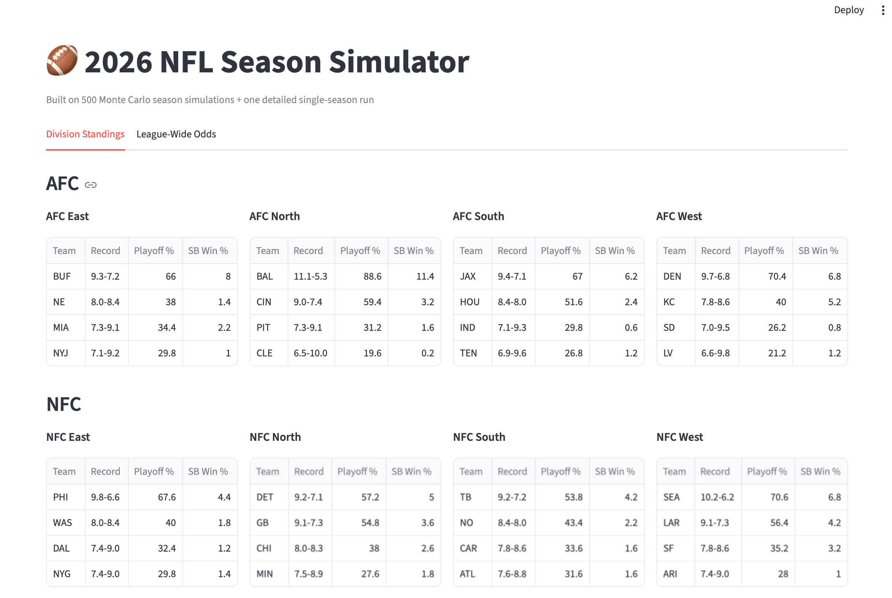
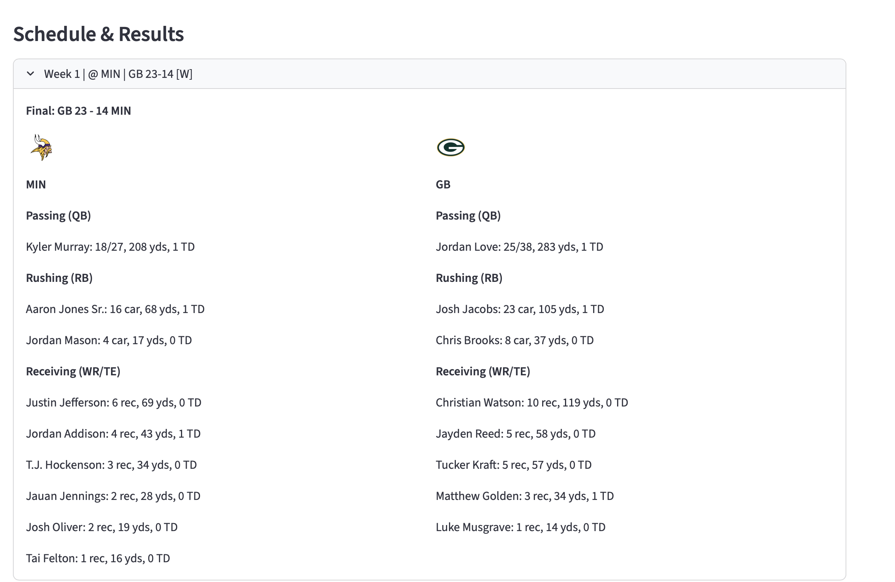
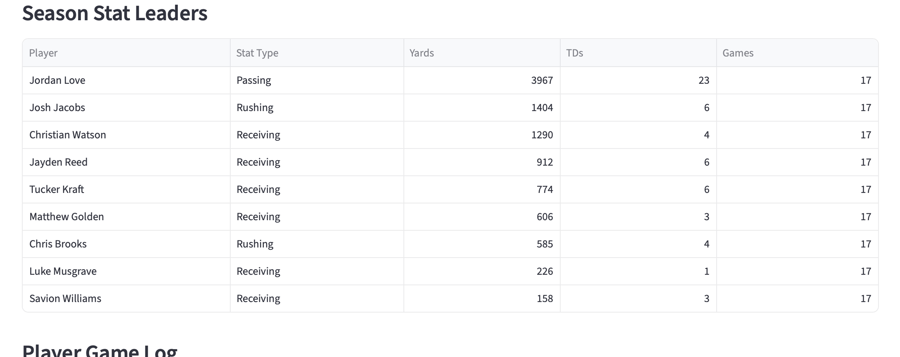
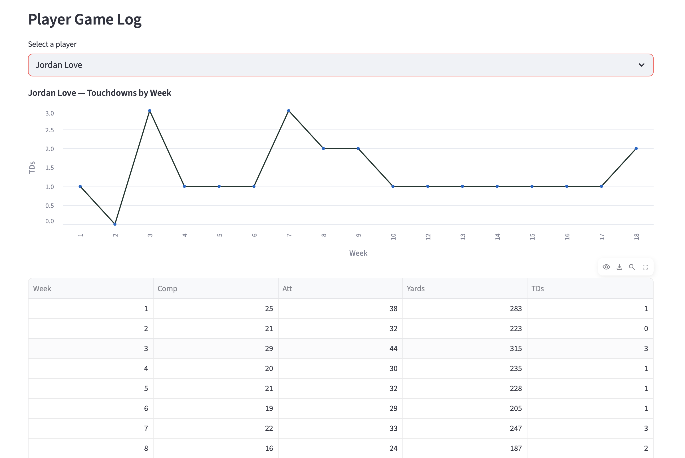
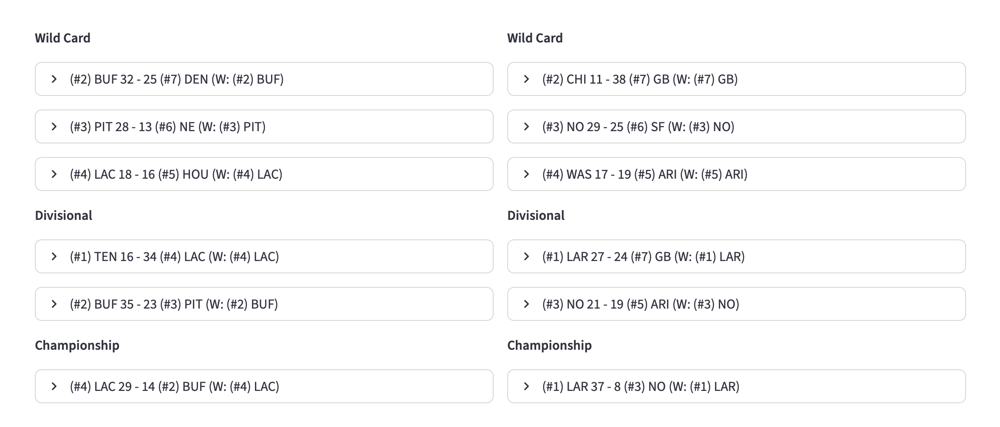
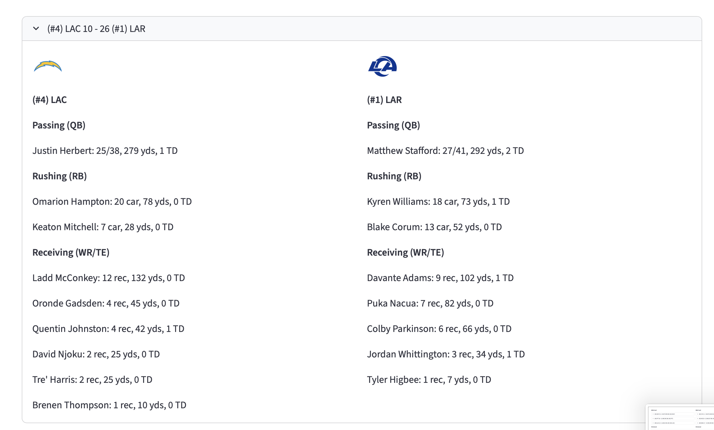
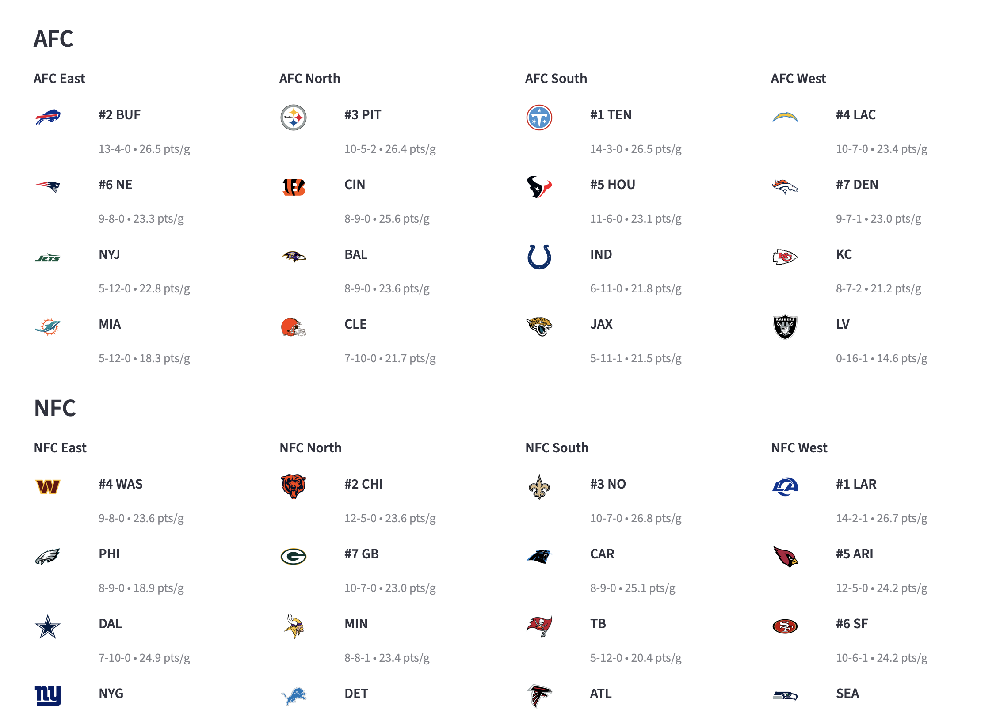
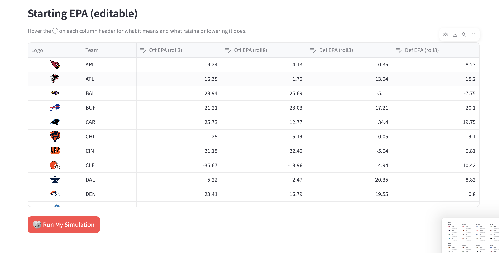

# 🏈 2026 NFL Season Simulator

This is a full **NFL season prediction** and sim engine built **end to end**. It is trained on XGBoost model that predicts every 2026 game and a Monte Carlo engine that runs the season 500 times to compute realistic playoff and "Big Game" odds. 



Includes a interactive Streamlit app built in collaboration with Claude to allow you to run your own sims with downloadable .csv's.

# What This Is

Given real historical NFL data from 2015-2024 pulled via nfl_data_py and each teams current depth chart, this project:
1. Predicts the point differentical for every 2026 regular season and playoff game using a trained **XGBoost Model**
2. Runs the full season 500 times (Monte Carlo simulation) to produce stable and realtics playoff and "Big Game" probabilities for all 32 teams
3. Runs one fully detailed season with real player level box scores
4. Wraps all of it into a interactive Steamlit app - including a page where you can adjust team strenghth inputs and power rankings to run your own sim

# How it works

- **Feature engineering**: rolling 3-game, 8-game, season-to-date team stats, opponent-adjusted EPA, rest days, weather and starter injury flags
- **Preason power rankings**: NFL.coms 2026 preson rankings feed a small, decaying Week nudge plus a permenent smallboost to a teams EPA throughout the season. This makes it so the #1 Team can't have a massive fall from grace.
- **Player stats**: team level yardage gets distrbuted down into player stats based on teams historical splits. For example, a team like the Cheifs rely heavily on their TE and WR1 so that is reflected
- **Monte Carlo**: 500 full season sims each with fresh randomness to make accurate playoff and "Big Game" odds

A handful of real bugs were caught and fixed along the way. Some include drive-count rounding bug that defalted league wid scoering across a season, massive discrepencies in QB attemps compared to real life and a playoff braket that had games ending in ties. The in-app How It Works page documents the methodology more in depth.

# The App

## Home - Standings & Odds
League wide player and "Big Game" odds based on teh 500 Monte Carlo sims

## Team Pages
From One Sim - Pick any team and see their simulated schedules, point-for and againist line chart and a season stat leader. Click into any game for the full box score, or into any player for their game by game log.

.png)








## Playoff Bracket
From One Sim - Has full simulated playoffs with season standings and game by game box scores








## Create Your Own Sim
Most interative part. Start by adjusting power rankings and different offensive/dfensive EPA rankings to run your own season. Hover over each catorgory to see how changing it will influence the sim. This season includes all the stats and game box scores mentioned above plus csvs for you to download with your own stats and a pdf with your winner.



# Tech Stack
- **Python** - pandas, numpy, scikit-lean, XGBoost
- **Data** - nfl_data_py, SQLite
- **App** - Streamlit, Altair, ReportLabs (PDF export), steamlit-sortables (drag and drop reordering)

# Running App Locally

```
python3 -m pip install -r requirements.txt
streamlit run app/Home.py
```

Note: data/nfl.db isn't included in repo because it exceeds GitHub file size limit - regenerate it by running notebooks 00-05 in order

# Known Limitations
- **The app is local-only, not deployed** - There is no live link in order to acess app you must run yourself. That is why screenshots are added to visually show app

- **2025 rolling stats are frozen and not live** - Player level EPA data isn't avliable for 2025 games so for that reason the last real EPA numbers used were 2024 not 2025. This obviously misses a layer of authencity that is being made up through preseason 2026 NFL rankings.

- **Player Skill Not Influenting Game** - Currently there is no system that shows that Josh Allen is a much better QB than Jacoby Brisset. It is just names on a screen. The actually player stats are based on pervious usage level however for the most part they signify the best players doing better. That being said this is something I would like to work on and fix in a 2027 version.

# What is Next
- Player level rating to evolve simulated weeks and provided for accurate stats
- More grandular injury modeling beyod the three tracked starter position
- Defensive team stats
- Live deployment

# Data Source
Historical play-by-play, roster, and schedule data via nflverse/nfl_data_py. Preseason power rankings via NFL.com (published August 2026).

